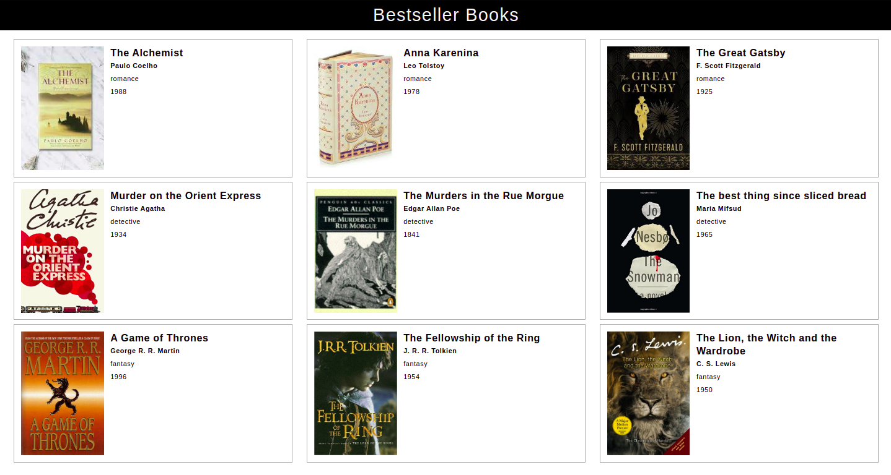

# Book Lists

## **Instructions**:

- In the `books.json` file, you can find a data structure for the details included the images, title, author and details of books.
- Import `books.json` into your `App.js` file.
- In the `App.js` file, create a program using map to display each book as a card with image, title, author.
- Fetch details from nested objects in json file.
- Style with CSS or inline styles.

